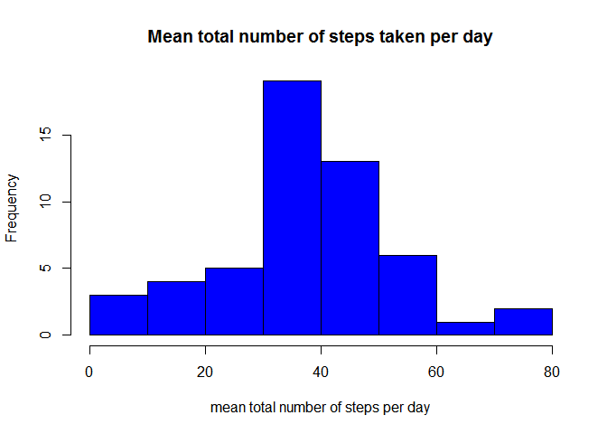
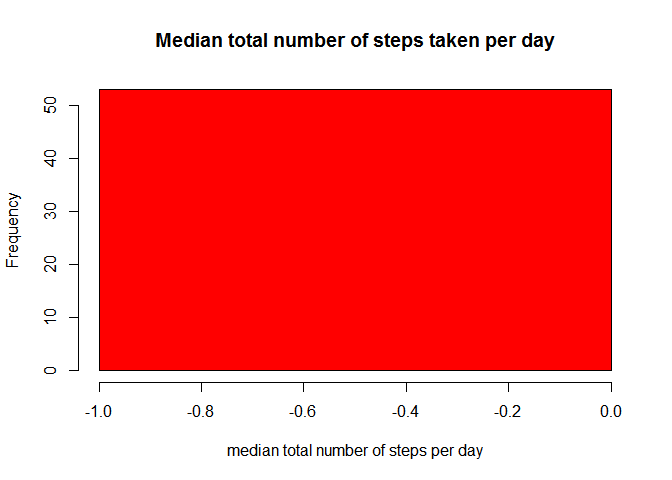
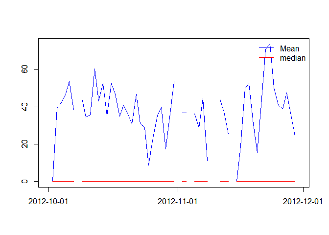
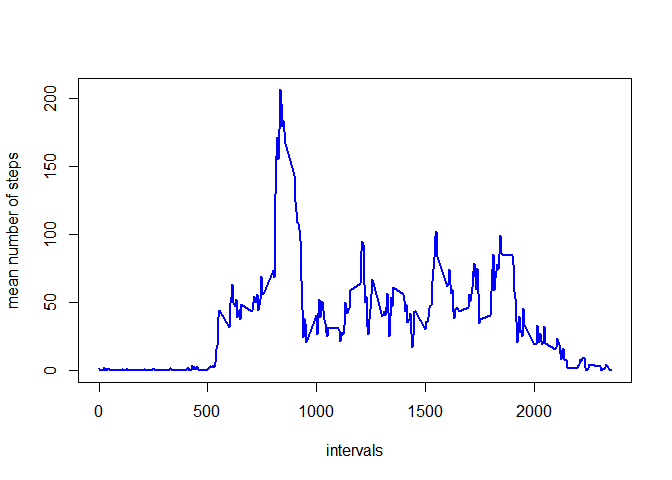
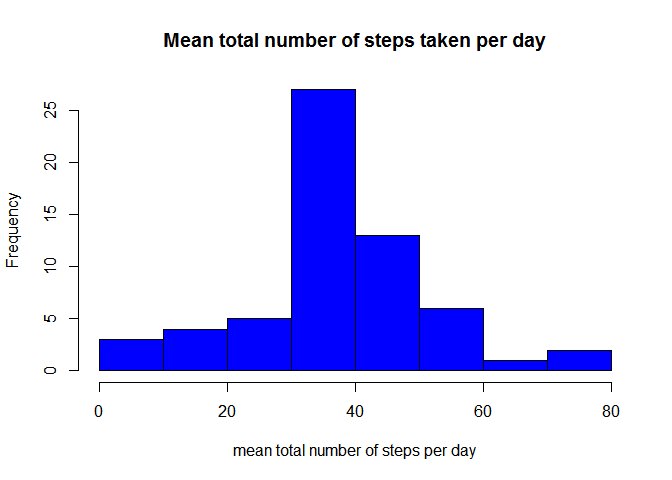
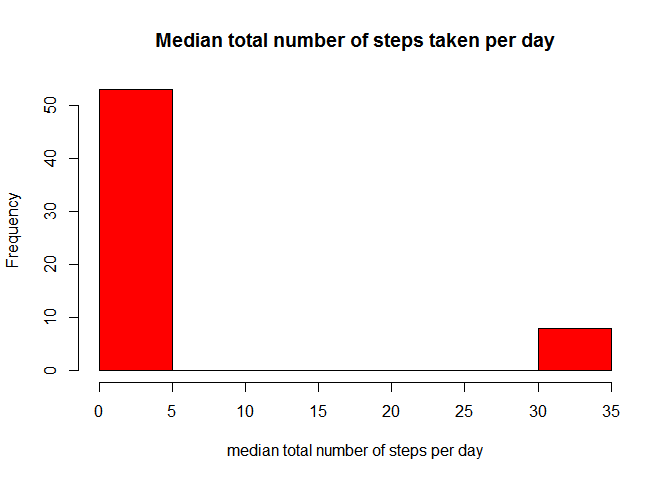
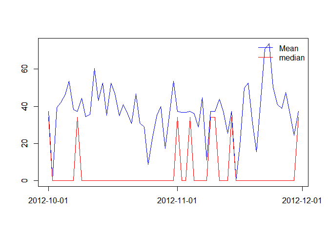
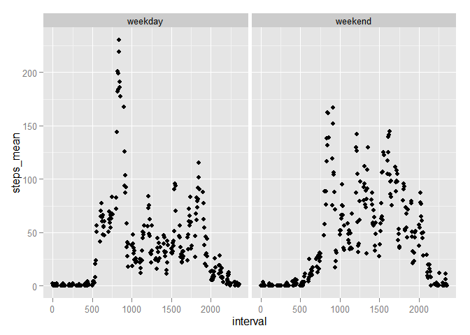

# Reproducible Research: Peer Assessment 1


## Loading and preprocessing the data
Downloading source file. Windows RStudio requires mode="wb"

```r
sourceURL <- "http://d396qusza40orc.cloudfront.net/repdata/data/activity.zip"
localZipFile <- "activity.zip"
localFile <- "activity.csv"

download.file(sourceURL, dest=localZipFile, mode="wb")
## unpack
unzip(localZipFile,exdir=".")
```
Read data file into R, date is converted to POSIXlc type.

```r
## read
activity<-read.csv(file=localFile,header=TRUE, na.strings="NA",stringsAsFactors = FALSE)
## convert to date
activity$DT <- as.POSIXct(strptime(activity$date,format="%Y-%m-%d"),tz="UTC")
```

## What is mean total number of steps taken per day?

```r
library(dplyr)
```
Mean total number of steps per day requires aggregation by date. min(), max() sd() are not necessary.

```r
activity_grp1 <- group_by(activity,DT)

activity_mean1 <- activity_grp1 %>% 
                   summarise(steps_mean=mean(steps,na.rm=TRUE), steps_sd=sd(steps,na.rm=TRUE),
                             steps_median=median(steps,na.rm=TRUE),
                             steps_min=min(steps,na.rm=TRUE),steps_max=max(steps,na.rm.=TRUE))
```


```r
hist(activity_mean1$steps_mean,main="Mean total number of steps taken per day",xlab="mean total number of steps per day",col="blue")
```

 

```r
hist(activity_mean1$steps_median,main="Median total number of steps taken per day",xlab="median total number of steps per day",col="red")
```

 
Mean and median per day

```r
# calculate y axis
yl<- c(  min( c(activity_mean1$steps_mean,activity_mean1$steps_median),na.rm=TRUE)  , max( c(activity_mean1$steps_mean,activity_mean1$steps_median),na.rm=TRUE ) )
## plot, but without x axis 
  plot(activity_mean1$DT,activity_mean1$steps_mean,type="l",col="blue",xlab="",ylab="", xaxt = "n", ylim=yl)
	par(new=T)
	plot(activity_mean1$DT,activity_mean1$steps_median,type="l",col="red",xlab="",ylab="", xaxt = "n", ylim=yl)
		## plot custom x axis
	axis.POSIXct(1,activity_mean1$DT, xlab="", format = "%Y-%m-%d")
	par(new=T)
	legend('topright','groups',c("Mean","median"), lty = c(1,1), col=c('blue','red'),bty="n")
```

 

## What is the average daily activity pattern?
To show daily activity pattern data will be aggregated by day for each 5min interval.

```r
library(dplyr)
```


```r
activity_grp2 <- group_by(activity,interval)

activity_mean2 <- activity_grp2 %>% 
                   summarise(steps_mean=mean(steps,na.rm=TRUE), steps_sd=sd(steps,na.rm=TRUE),
                             steps_min=min(steps,na.rm=TRUE),steps_max=max(steps,na.rm.=TRUE))
```


```r
plot(activity_mean2$interval, activity_mean2$steps_mean , type="l", xlab= "intervals", ylab= "mean number of steps", col="blue" , lwd=2)
```

 


## Imputing missing values
Source data contain many rows without value for steps column

```r
table(is.na(activity$steps))
```

```
## 
## FALSE  TRUE 
## 15264  2304
```
NA values will be replaced by mean value of steps for that interval

```r
activity2<-activity
```

```r
for(i in 1:nrow(activity2)){
  if (is.na( activity2[i,"steps"]) ) {
    d_int<-activity2[i,"interval"]
    s<-activity_mean2[activity_mean2$interval==d_int,"steps_mean"]
    if ( !is.na(s)) {     
      activity2[i,"steps"]<-s  
    }
  }
}
```

```r
table(is.na(activity2$steps))
```

```
## 
## FALSE 
## 17568
```
Mean total number of steps per day requires aggregation by date. min(), max() sd() are not necessary.

```r
library(dplyr)
```

```r
activity2_grp1 <- group_by(activity2,DT)

activity2_mean1 <- activity2_grp1 %>% 
                   summarise(steps_mean=mean(steps,na.rm=TRUE), steps_sd=sd(steps,na.rm=TRUE),
                             steps_median=median(steps,na.rm=TRUE),
                             steps_min=min(steps,na.rm=TRUE),steps_max=max(steps,na.rm.=TRUE))
```


```r
hist(activity2_mean1$steps_mean,main="Mean total number of steps taken per day",xlab="mean total number of steps per day",col="blue")
```

 

```r
hist(activity2_mean1$steps_median,main="Median total number of steps taken per day",xlab="median total number of steps per day",col="red")
```

 
Mean and median per day

```r
# calculate y axis
yl<- c(  min( c(activity2_mean1$steps_mean,activity2_mean1$steps_median),na.rm=TRUE)  , max( c(activity2_mean1$steps_mean,activity2_mean1$steps_median),na.rm=TRUE ) )
## plot, but without x axis 
  plot(activity2_mean1$DT,activity2_mean1$steps_mean,type="l",col="blue",xlab="",ylab="", xaxt = "n", ylim=yl)
  par(new=T)
	plot(activity2_mean1$DT,activity2_mean1$steps_median,type="l",col="red",xlab="",ylab="", xaxt = "n", ylim=yl)
		## plot custom x axis
	axis.POSIXct(1,activity2_mean1$DT, xlab="", format = "%Y-%m-%d")
	par(new=T)
	legend('topright','groups',c("Mean","median"), lty = c(1,1), col=c('blue','red'),bty="n")
```

 
Peaks in median value are corresponding to days where all measures had steps equal NA.

```r
unique(activity[is.na(activity$steps),"DT"])
```

```
## [1] "2012-10-01 UTC" "2012-10-08 UTC" "2012-11-01 UTC" "2012-11-04 UTC"
## [5] "2012-11-09 UTC" "2012-11-10 UTC" "2012-11-14 UTC" "2012-11-30 UTC"
```

## Are there differences in activity patterns between weekdays and weekends?


```r
library(timeDate)
library(ggplot2)
```

```r
activity2$wkday <- ifelse(isWeekday(activity2$DT),"weekday","weekend")
activity2_grp2 <- group_by(activity2,interval,wkday)

activity2_mean2 <- activity2_grp2 %>% 
                   summarise(steps_mean=mean(steps), steps_sd=sd(steps),
                             steps_median=median(steps),
                             steps_min=min(steps),steps_max=max(steps))
```


```r
ggplot(data=activity2_mean2 , aes( interval , steps_mean) )  + geom_point() + facet_grid( . ~ wkday) 
```

 
